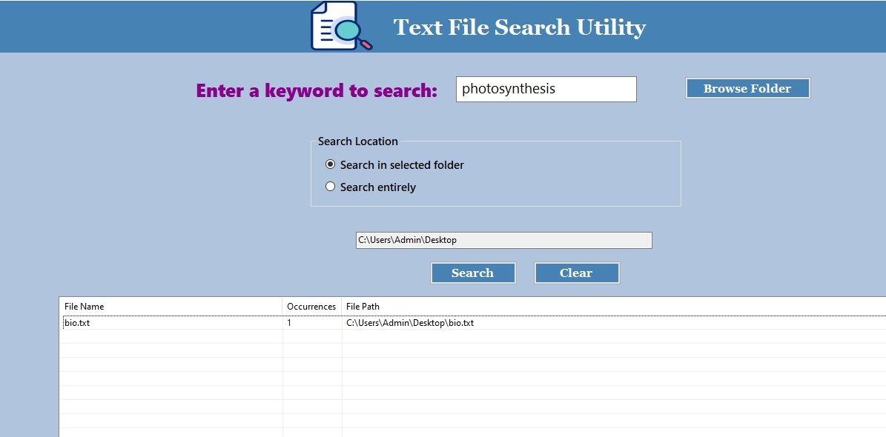

# Text File Search Utility

A simple C# .NET Windows Forms application for searching keywords inside text files.

## Features

- Search for a keyword inside `.txt` files
- Search within a selected folder and its subfolders
- Search across the C: drive
- Display matching files and the number of matches
- Open files and highlight matching keywords

## Technologies Used

- C#
- .NET
- Windows Forms
- Visual Studio

## How to Run

1. Open `dotnet_miniproject.sln` in Visual Studio.
2. Build the project.
3. Run the application.
4. Select a folder or search the entire system.
5. Enter a keyword and click **Search**.
## Screenshot

